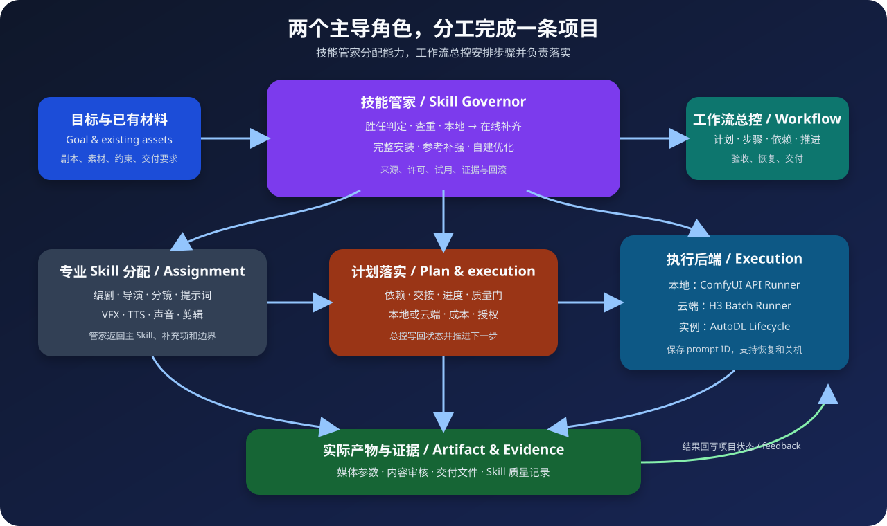
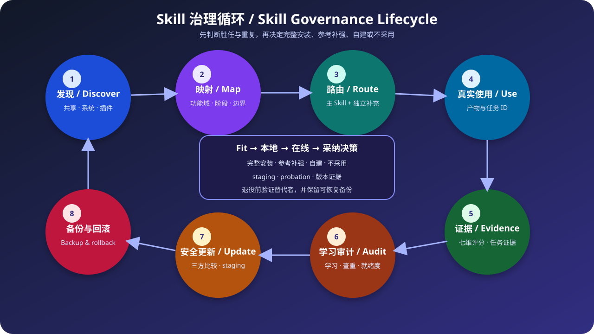
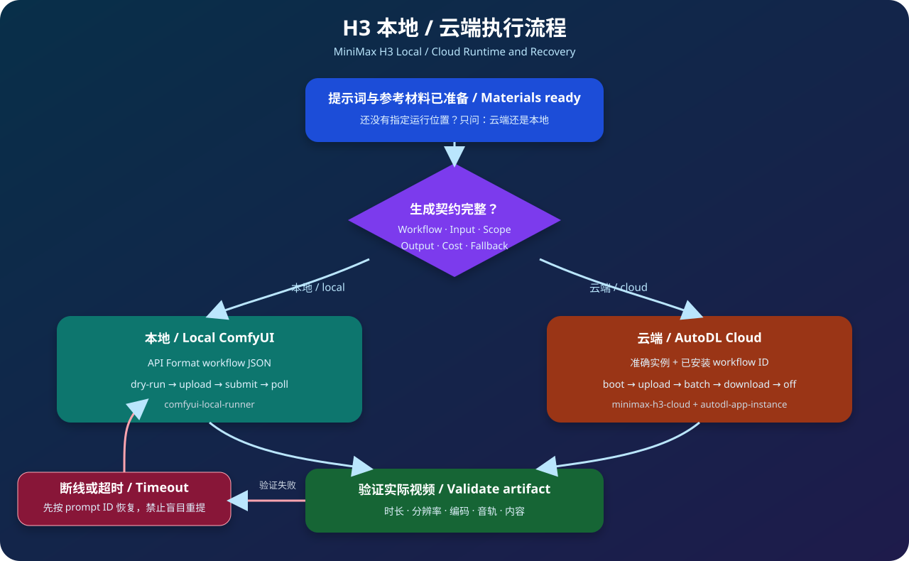

# AI 创作流程：从 Skill 管理到 H3 出片

[English](README.en.md)

做一条 AI 视频，麻烦往往不在某一个步骤。剧本放在一个目录，参考图在另一个目录；提示词改过几版，却没人记得最终用了哪版；本地显卡跑不动临时换云端，生成失败后又不知道该重试还是接着轮询。Skill 装得越多，选哪个也会变成新的问题。

这个仓库整理的是一套实际可执行的工作方式。它会记住项目要交什么、当前做到哪一步、下一步该用哪个 Skill，以及真正生成前还缺哪些确认。H3 既能交给本机 ComfyUI，也能调用 AutoDL 实例里已经装好的工作流。

你可以从一句需求开始，让它组织完整项目；也可以只拿其中一部分来用，比如整理 Skill、跑一份本地 ComfyUI 清单，或者提交一批云端 H3 任务。编剧、导演、提示词、VFX 和声音仍由各自的专业 Skill 完成，这个仓库负责把步骤和结果接起来。

按你的情况直接看对应部分：

- 第一次使用，先看[快速安装](#快速安装)。
- 想跑完整项目，看[`ai-creation-workflow`](#1-ai-creation-workflow创作项目总控)。
- Skill 太多不好管理，看[`skill-governor`](#2-skill-governor技能管家)。
- 已经准备好 H3 材料，看[`h3-runtime-router`](#3-h3-runtime-routerh3-本地云端决策)。
- 在自己电脑上生成，看[本地 ComfyUI 执行](#4-comfyui-local-runner本地-comfyui-执行)。
- 租 AutoDL 实例生成，看[云端 H3 执行](#6-minimax-h3-cloud云端-h3-工作流执行)。

## 它怎么串起来



这里有两个主导角色，分工很明确：

| 主导角色 | 负责什么 | 不负责什么 |
|---|---|---|
| `skill-governor` 技能管家 | 管理 Skill 库，发现、登记、分配、查重、评估、升级、备份和回滚 | 不替项目写计划，不追踪项目进度，不冒充专业 Skill 产出内容 |
| `ai-creation-workflow` 工作流总控 | 理解目标，列出执行计划和详细步骤，安排依赖，推进每一步，验收和交付 | 不直接修改 Skill 库，不替专业 Skill 发明工艺 |

总控在建立或修改阶段时，把“要产出什么、手里有什么、用什么工具、怎么验收”交给技能管家。技能管家返回最合适的主 Skill、必要的补充 Skill、边界和缺口，总控再把这项分配写入计划并负责落实。

| 执行支持 | 核心功能 | 典型使用场景 |
|---|---|---|
| `h3-runtime-router` | H3 本地/云端选择、生成契约、成本和失败策略 | 提示词与素材已经完成，准备开始渲染 |
| `comfyui-local-runner` | 用 JSON 清单执行本机 ComfyUI API 工作流 | 本地模型与工作流已经装好，希望稳定复现参数 |
| `minimax-h3-cloud` | 检查云端已装工作流、批量提交、轮询、下载和关机 | 使用 AutoDL 中已有的 H3 工作流进行付费生成 |
| `autodl-app-instance` | 查询、启动、发现面板、关闭 AutoDL 应用实例 | 云端生成前后的实例生命周期管理 |

编剧、导演、分镜、提示词、特效和声音设计属于可插拔专业能力。总控按“功能域、工作阶段、输入输出和能力边界”调用它们，不在代码里绑定某一个私有 Skill 名称。

AI 视频只是总控可以调用的一个领域包。剧本、分镜、提示词、VFX、TTS 和声音等专业 Skill 按阶段接入；H3 只是其中一条执行路线。

后续架构与实现任务已经整理为 [`docs/pending-execution-plan.md`](docs/pending-execution-plan.md)。计划重点是双核心、可插拔领域包、前置需求摸清、低打扰门禁、可恢复 Skill 退役和运行可靠性；当前状态为待执行。

## 快速安装

建议使用 Python 3.11 或更高版本。

```powershell
git clone https://github.com/kazeizumi/ai-creation-workflow.git
cd ai-creation-workflow
python scripts/install.py --dry-run
python scripts/install.py --yes
```

`--dry-run` 只展示安装计划。`--yes` 才会写入，默认安装位置是 `~/.agents/skills`。如果目标位置已有同名 Skill，安装器会先复制到 `.ai-creation-workflow-backups`，再安装新版本。

只安装部分组件：

```powershell
python scripts/install.py --skill ai-creation-workflow --skill skill-governor --yes
```

安装到其他目录：

```powershell
python scripts/install.py --target "D:\MyAgent\skills" --yes
```

云端运行还需要 `httpx`：

```powershell
python -m pip install -r skills/minimax-h3-cloud/requirements.txt
```

安装后如果当前 Agent 没有立即发现新 Skill，请刷新技能列表或重新开始一个会话。

## 1. `ai-creation-workflow`：创作项目总控

### 什么时候使用

当任务包含两个以上相互依赖的阶段，或者涉及付费生成、多次渲染、多人交接、长期续作时，用它负责项目计划和执行。例如：

- 从故事梗概制作一支完整 AI 短片。
- 把锁定剧本拆成内容单元、镜头和 H3 生成段。
- 协调角色设定、参考图、提示词、配音、特效和最终交付。
- 中断数天后恢复项目，并从第一个可执行阶段继续。

### 怎么使用

在支持 Skill 的 Agent 中直接说明目标：

```text
使用 $ai-creation-workflow，把这份锁定剧本制作成 16:9 AI 叙事短片。
交付物需要包含镜头表、H3 中英文提示词、参考图上传顺序和最终视频。
```

总控会根据规模选择三种控制模式：

| 模式 | 使用条件 | 状态管理 |
|---|---|---|
| Direct | 单个明确、可撤销步骤 | 直接调用已知专业 Skill |
| Light | 2–4 个有依赖的阶段 | 在会话中维护简短契约与检查点 |
| Full | 跨阶段、付费、批量或需要恢复 | 创建项目控制文件和 JSON 状态文件 |

Full 模式建议从以下模板开始：

```text
templates/00-project-control.md
templates/workflow-state.json
```

总控会依次完成：复用已有材料、定义交付和验收、建立阶段依赖、请技能管家分配专业 Skill、执行阶段、进入质量或费用门、验证实际产物、记录交付和使用证据。

阶段状态包括 `pending`、`ready`、`running`、`blocked`、`review`、`accepted` 和 `failed`。上游锁定内容变化后，下游阶段应先标记为失效，再重新执行。

### AI 视频默认阶段

```text
目标与材料
→ 剧本
→ 内容单元 C
→ 故事镜头 SH
→ 生成段 G
→ 参考材料与上传顺序
→ 中英文提示词
→ 本地/云端运行选择
→ 渲染
→ 媒体验收
→ 剪辑与声音
→ 交付
```

每个生成段都应自包含开场状态、动作或变化过程、结束状态。不要假设视频模型能记住上一段请求。

## 2. `skill-governor`：技能管家



### 什么时候使用

- 安装新 Skill 后，希望把它放进合适的功能域和工作阶段。
- 多个 Skill 都能“写提示词”或“做分镜”，需要判断主次和边界。
- Skill 更新后，想知道行为文件是否变化、旧映射是否失效。
- 希望记录某个 Skill 在真实任务中的成功、部分成功或失败证据。
- 准备合并、停用或替换 Skill，需要备份和回滚能力。

### 扫描、分配和查看路由

```powershell
python skills/skill-governor/scripts/skill_registry.py scan
python skills/skill-governor/scripts/skill_registry.py report --include-unready
python skills/skill-governor/scripts/skill_registry.py report --lane video-runtime
python skills/skill-governor/scripts/skill_registry.py duplicates
python skills/skill-governor/scripts/skill_registry.py validate
```

默认扫描：

- `~/.agents/skills` 中的共享 Skill；
- `~/.codex/skills/.system` 中的系统 Skill；
- Codex 配置中已启用插件暴露的 Skill。

第一次接入已有大型技能库时，先备份 `registry`，再为已安装能力补充 `skill-roadmap.json`。本仓库自带的 roadmap 只登记本项目的六个核心 Skill，不能替代你现有技能库的完整路由表。

### 登记一个 Skill

在 `skills/skill-governor/registry/skill-roadmap.json` 中填写：

- `lane`：功能域；
- `stage`：工作流阶段；
- `brief`：能力摘要；
- `use_when`：正向触发条件；
- `boundary`：不负责什么；
- `role`：主 Skill、专项、备选、补充或独立能力；
- `review_level`：只看描述或已完整审读；
- `overlap_group`：需要同题比较的能力组。

完整审读后，将映射绑定到当前行为指纹：

```powershell
python skills/skill-governor/scripts/skill_registry.py ack-map --skill h3-runtime-router --review-level full-reviewed
```

### 学习、评分和生命周期

新装 Skill 默认是 `probation`（试用）。技能管家会把它放进限定场景，用同一个真实请求和现有主 Skill 做 A/B，再根据证据决定是否进入主路由。评分和使用次数分开：使用多不等于质量高，项目整体失败也不能直接把所有参与 Skill 一起扣分。

质量证据至少要能归因到当前 Skill，并绑定任务 ID 和行为指纹。七个维度各按 1–5 分：适配 `fit`、产物 `output`、稳定 `reliability`、效率 `efficiency`、维护 `maintainability`、独特性 `uniqueness`、安全 `safety`。只有用户明确反馈、独立回归或可测量变化时才记录评分：

```powershell
python skills/skill-governor/scripts/skill_registry.py record-outcome `
  --skill h3-runtime-router `
  --task-id project-001-G01 `
  --fit 5 --output 5 --reliability 4 --efficiency 4 `
  --maintainability 5 --uniqueness 4 --safety 5 `
  --verdict pass `
  --source user `
  --evidence "完成本地/云端决策，生成契约可直接交给执行器" `
  --artifact artifacts/project-001/runtime-contract.md
```

审计会把 Skill 分到 `keep-core`（核心）、`keep-specialist`（专项）、`trial-review`（试用）、`observe`（观察）、`compare`（对比）、`repair`（修复）、`quarantine-review`（隔离审查）或 `protected`（受保护）。更新版本会保留旧证据，但新版本重新试用。

记录真实使用和生成审计报告：

记录一次实际调用：

```powershell
python skills/skill-governor/scripts/skill_audit.py record-use `
  --skill h3-runtime-router `
  --task-id project-001-G01 `
  --result completed `
  --reason "正确完成本地与云端选择并形成生成契约"
```

生成技能组合审计报告：

```powershell
python skills/skill-governor/scripts/skill_audit.py audit `
  --output-json skill-audit.json `
  --output-md skill-audit.md
```

使用频率和质量评价分开保存。出现重复候选只会触发同题 A/B 审查，不会自动删除 Skill。完整规则见 [`skills/skill-governor/references/evolution.md`](skills/skill-governor/references/evolution.md)。

### 退役和淘汰门禁

只有在替代者已通过测试、独特能力已经迁移、同题 A/B 不劣、近期使用和历史依赖已核对、许可证允许整合，并且有日期化可恢复备份时，技能管家才会提出退役建议。移动、停用、合并或删除仍需用户明确批准；默认移入归档，并写入 `registry/skill-retirements.json`，不做永久删除。

### 安全更新和回滚

先做三方比较：基线版本、当前本地版本、待安装上游版本。无冲突后生成 staging，再备份并激活。工具入口：

```powershell
python skills/skill-governor/scripts/skill_transaction.py prepare --help
python skills/skill-governor/scripts/skill_transaction.py backup --help
python skills/skill-governor/scripts/skill_transaction.py activate --help
python skills/skill-governor/scripts/skill_transaction.py rollback --help
```

系统 Skill 和插件管理的 Skill 默认视为受保护对象。共享 Skill 才进入本地三方合并流程。

## 3. `h3-runtime-router`：H3 本地/云端决策



### 什么时候使用

当提示词、参考图和视频段参数已经准备好，需要真正调用 H3 时使用。如果用户只说“生成 H3 视频”而没有指定运行位置，它先问一个问题：**云端还是本地？** 已经指定后不重复询问。

### 生成前必须形成的契约

使用 [`templates/h3-generation-contract.md`](templates/h3-generation-contract.md) 明确：

- 本地或云端；
- 准确的工作流文件、名称或 ID；
- 提示词、参考文件和真实上传顺序；
- 任务数量、每段时长、分辨率和关键采样参数；
- 输出目录；
- 预计成本；
- 超时、重试和失败回退；
- 云端任务结束后是否关机；
- 本次生成授权。

提示词、参考计划或故事板通过审核，只能证明材料准备完成，不代表已经授权提交 ComfyUI。每一次新生成都需要对应的执行范围；同一任务的断线恢复和轮询重试可沿用原任务 ID。

### 成本计算

```text
单条直接计算成本 = 实例每小时价格 × 实际占用分钟数 ÷ 60
```

仓库保留了一个可编辑的 10 秒 H3 二采样例：

| 实例 | 每小时价格 | 实测时间 | 单条成本 |
|---|---:|---:|---:|
| RTX 5090 | ¥3.00 | 8–9 分钟 | ¥0.40–0.45 |
| RTX 4080 | ¥1.80 | 12–15 分钟 | ¥0.36–0.45 |

实际比较应使用“每条成功视频”的总时间，把开机、上传、排队、失败重试和关机时间一起计入。

## 4. `comfyui-local-runner`：本地 ComfyUI 执行

### 适用条件

- 本机 ComfyUI 已经运行；
- 模型、自定义节点和工作流依赖已经安装；
- 工作流已从 ComfyUI 导出为 **API Format JSON**；
- 精确节点输入、输出目录和失败回退已经确认。

它不会启动 ComfyUI、安装节点、转换普通 UI 工作流，也不会自动编写提示词。

### 准备本地清单

参考 [`examples/minimal-project/local-h3-job.json`](examples/minimal-project/local-h3-job.json)：

```json
{
  "schema_version": 1,
  "base_url": "http://127.0.0.1:8188",
  "workflow": "workflow_api.json",
  "output_dir": "results",
  "poll_seconds": 5,
  "timeout_seconds": 7200,
  "input_values": {
    "28:prompt": {"$text_file": "Prompt_EN.txt"},
    "27:value": 10,
    "29:megapixels": 0.6,
    "54:value": 1.5,
    "66:image": {"$upload": "Picture_01.png"}
  }
}
```

`input_values` 的键必须是工作流中真实存在的 `节点ID:输入名`。`$text_file` 读取 UTF-8 文本，`$upload` 在提交前上传文件，普通 JSON 值直接覆盖节点输入。

先验证，不连接 ComfyUI：

```powershell
python skills/comfyui-local-runner/scripts/run_local.py path/to/local-job.json --dry-run
```

确认生成契约后正式运行：

```powershell
python skills/comfyui-local-runner/scripts/run_local.py path/to/local-job.json
```

运行器会上传文件、修改节点输入、提交一次请求、按 `prompt_id` 轮询、下载所有输出，并写入 `run-state.json`。默认只允许 `127.0.0.1`、`localhost` 和 `::1`；明确连接远程 ComfyUI 时才使用 `--allow-remote`。

如果客户端超时，先读取 `run-state.json` 中的 `prompt_id` 并查询 ComfyUI 历史。不要直接再次提交，以免产生重复长任务。

## 5. `autodl-app-instance`：AutoDL 实例管理

### 配置 Token

脚本优先读取当前进程的 `AUTODL_TOKEN`，否则读取：

```text
Windows: %USERPROFILE%\.config\autodl.env
macOS/Linux: ~/.config/autodl.env
```

文件内容只有一行：

```text
AUTODL_TOKEN=在本地填写真实开发者Token
```

也可以用 `AUTODL_ENV_FILE` 指向其他本地文件。不要把 Token 放进 Git、JSON 清单或命令行参数。

Windows 环境检查：

```powershell
powershell -ExecutionPolicy Bypass -File skills/autodl-app-instance/scripts/doctor.ps1
```

增加 `-Probe` 会调用只读实例列表接口：

```powershell
powershell -ExecutionPolicy Bypass -File skills/autodl-app-instance/scripts/doctor.ps1 -Probe
```

### 生命周期命令

```powershell
python skills/autodl-app-instance/scripts/autodl_instance.py list
python skills/autodl-app-instance/scripts/autodl_instance.py status --uuid pro-xxxxxxxxxxxx
python skills/autodl-app-instance/scripts/autodl_instance.py snapshot --uuid pro-xxxxxxxxxxxx
python skills/autodl-app-instance/scripts/autodl_instance.py boot --uuid pro-xxxxxxxxxxxx
python skills/autodl-app-instance/scripts/autodl_instance.py off --uuid pro-xxxxxxxxxxxx --wait
```

`boot` 会等待实例运行，并从本次快照重新发现当前 ComfyUI 面板地址。重启后不要复用旧面板 URL。脚本不会释放或删除实例。

## 6. `minimax-h3-cloud`：云端 H3 工作流执行

### 第一次检查实例里已有的工作流

先启动获准的实例：

```powershell
python skills/autodl-app-instance/scripts/autodl_instance.py boot --uuid pro-xxxxxxxxxxxx
```

把 `boot` 返回的当前 `panel_url` 保存为本次会话环境变量：

```powershell
$env:SEETACLOUD_BASE_URL = "https://本次返回的面板地址"
```

列出真实存在的工作流：

```powershell
python skills/minimax-h3-cloud/scripts/workflow_tool.py list `
  --base-url $env:SEETACLOUD_BASE_URL
```

按准确 `workflow_id` 检查输入槽，并保存映射：

```powershell
python skills/minimax-h3-cloud/scripts/workflow_tool.py inspect `
  --base-url $env:SEETACLOUD_BASE_URL `
  --workflow-id "准确的工作流ID" `
  --out workflow-map.json
```

如果这次只是检查工作流，检查完成后关机：

```powershell
python skills/autodl-app-instance/scripts/autodl_instance.py off --uuid pro-xxxxxxxxxxxx --wait
```

### 创建批量清单

参考 [`examples/minimal-project/cloud-h3-batch.json`](examples/minimal-project/cloud-h3-batch.json)：

```json
{
  "instance_uuid": "pro-xxxxxxxxxxxx",
  "keep_on": false,
  "poll_timeout_seconds": 3600,
  "max_parallel_polls": 3,
  "state_file": "batch-state.json",
  "jobs": [
    {
      "name": "G01",
      "workflow_id": "准确的已安装工作流ID",
      "output": "results/G01.mp4",
      "input_values": {
        "664:prompt": "完整且自包含的H3提示词",
        "132:value": 10,
        "29:megapixels": 0.6,
        "54:value": 1.5,
        "137:image": {"$upload": "refs/Picture_01.png"}
      }
    }
  ]
}
```

输入键必须来自当前工作流的 `inspect` 结果。切换实例或工作流后重新检查，不要复用旧节点映射。

先做离线检查：

```powershell
python skills/minimax-h3-cloud/scripts/run_batch.py path/to/batch.json --dry-run
```

生成范围获得确认后正式执行：

```powershell
python skills/minimax-h3-cloud/scripts/run_batch.py path/to/batch.json
```

批处理运行器会：

1. 查询并启动准确实例；
2. 发现本次有效面板地址；
3. 上传所有 `$upload` 文件；
4. 在轮询前先提交整批任务；
5. 只按各自 `prompt_id` 关联结果；
6. 使用 `.part` 文件流式下载；
7. 在可用时调用 `ffprobe` 验证媒体；
8. 无论成功或失败都进入 `finally` 关机。

如果实例本来已经运行，工具默认拒绝接管，因为其中可能有无关任务。先检查队列，确认该批任务可以拥有实例关机权后，再使用：

```powershell
python skills/minimax-h3-cloud/scripts/run_batch.py path/to/batch.json --adopt-running-instance
```

只有用户明确要求生成后保持开机，清单中才设置 `keep_on: true`，同时命令增加 `--allow-keep-on`。

## 三种常见使用方式

### A. 从创意到最终视频

```text
使用 $ai-creation-workflow 完成这个 AI 短片项目。
先复用项目内剧本和角色资料，完成镜头、参考材料和 H3 提示词。
真正生成前让我选择云端或本地，并给出费用与失败回退。
```

总控负责阶段和状态；专业 Skill 负责内容；运行路由负责本地/云端；执行器负责提交与下载。

### B. 材料已经准备好，只执行 H3

```text
使用 $h3-runtime-router 执行这段 10 秒 H3 视频。
工作流、提示词和参考图都在 project/G01，输出到 project/results。
```

如果没有说运行位置，系统只追问云端还是本地；随后完成生成契约并交给对应执行器。

### C. 整理越来越多的 Skill

```text
使用 $skill-governor 扫描我的共享 Skill，列出未映射、指纹变化和能力重复项。
先给审计结果，不自动停用或覆盖任何 Skill。
```

治理工具负责提供证据和候选动作。合并、覆盖和退役仍要经过可恢复备份和明确的变更范围。

## Token 消耗与子代理

总控默认使用自适应精简策略：direct/light 只加载当前请求、权威输入和当前 Skill；full 读取项目契约、决策索引、当前阶段及直接依赖。稳定事实只保存一次，下游引用文件路径、版本或决策 ID，不重复复制正文。已确认且输入、工具、约束和行为指纹没有变化的 Skill 分配直接复用。

子代理不是按 Skill 数量创建。只有 full 工作流中至少两个节点已经 `ready`，它们没有前后依赖、写入位置和外部资源互不冲突、输入与验收完整，并且并行收益大于上下文复制和结果合并成本时才使用。子代理只接收当前节点的精简任务包，根代理继续负责用户沟通、整合和最终验收。详细规则见 [`token-and-delegation.md`](skills/ai-creation-workflow/references/token-and-delegation.md)。

## 审批、重试和验收规则

以下节点需要明确的当前范围：付费实例启动、真实 ComfyUI 提交、外部发布、不可恢复的 Skill 替换，以及会改变已锁定创作内容的决定。

每次真实生成至少说明：工作流、输入、时长或批量范围、输出目录和失败回退。云端还要说明实例与关机策略。

命令退出码只能证明程序是否正常结束。视频交付还应检查实际时长、分辨率、帧率、编码、音轨、画面内容以及是否符合创作目标。故事板或提示词通过审核不能代替渲染验收。

超时后优先恢复既有 `prompt_id` 或外部任务 ID。只有确认旧任务没有提交或已经失败且不会继续运行时，才创建新任务。

## 仓库目录

```text
skills/
  ai-creation-workflow/   项目总控
  skill-governor/         Skill 治理
  h3-runtime-router/      H3 运行选择
  comfyui-local-runner/   本地执行器
  minimax-h3-cloud/       云端批处理执行器
  autodl-app-instance/    AutoDL 实例管理
templates/                项目状态与生成契约模板
examples/minimal-project/ 可离线 dry-run 的最小示例
scripts/install.py        带备份的安装器
scripts/verify_release.py 发布前检查
```

## 验证和开发

运行全部离线验证：

```powershell
python scripts/verify_release.py
python skills/skill-governor/scripts/test_skill_governor.py
python skills/comfyui-local-runner/scripts/run_local.py examples/minimal-project/local-h3-job.json --dry-run
python skills/minimax-h3-cloud/scripts/run_batch.py examples/minimal-project/cloud-h3-batch.json --dry-run
```

这些 dry-run 不启动实例，不上传素材，也不提交生成任务。

`verify_release.py` 会检查 Skill 结构、Python 语法、JSON、内部链接、生成缓存、疑似 JWT 和私有绝对路径。发布前还应确认第三方模型、工作流、自定义节点和素材各自允许再分发。

## 安全与发布边界

- 不要提交 API Token、实例密码、签名 URL、私有参考素材和客户视频。
- 本仓库的 `.env.example` 只是字段示例；AutoDL 工具实际读取环境变量或 `~/.config/autodl.env`。
- `autodl-app-instance` 不包含释放和删除实例的接口。
- 仓库发布总控规则和执行适配器，不发布模型权重、第三方工作流或商业素材。
- AutoDL、MiniMax 和 ComfyUI 名称归各自权利方所有，本项目是独立集成。

许可证：MIT。来源和改写说明见 [`NOTICE.md`](NOTICE.md)。
