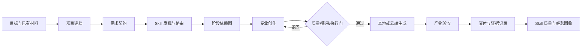

# AI 创作工作流

这是一套可移植的 AI 创作总控系统，覆盖 Skill 管理、项目建档、需求契约、阶段拆解、专业 Skill 路由、质量门、H3 本地/云端执行、结果验收与经验回收。

## 六个核心 Skill

| Skill | 作用 |
|---|---|
| `ai-creation-workflow` | 总控项目、阶段、依赖、状态、审批门和交付 |
| `skill-governor` | 发现、登记、评估、查重、升级、回滚 Skill |
| `h3-runtime-router` | 询问本地或云端，检查生成授权并估算成本 |
| `comfyui-local-runner` | 用清单驱动本机 ComfyUI API 工作流 |
| `minimax-h3-cloud` | 检查云端已装工作流、批量提交、下载并关机 |
| `autodl-app-instance` | 管理 AutoDL 应用实例生命周期与面板地址 |

编剧、导演、分镜、提示词、特效、声音等专业 Skill 作为可插拔能力存在。总控按“功能域 + 阶段 + 边界”选择，不要求公开仓库安装某一套私有 Skill。

## 安装

建议使用 Python 3.11 或更高版本。先预览，再安装：

```powershell
python scripts/install.py --dry-run
python scripts/install.py --yes
```

默认安装到 `~/.agents/skills`。可用 `--target` 改目录，用多个 `--skill` 只装指定 Skill。

云端功能另需：

```powershell
python -m pip install -r skills/minimax-h3-cloud/requirements.txt
```

复制 `.env.example` 为 `.env`，只在本地填写 `AUTODL_TOKEN`。真实 Token、私有素材、客户视频、云端签名地址和本机绝对路径都不进入 Git。

## 总控流程



总控先复用当前会话和项目材料。只有缺失信息会改变目标、范围、费用、权限或不可逆结果时才提问。普通可撤销实现细节直接采用合理默认。

当用户说“生成 H3 视频”而未指定运行位置时，`h3-runtime-router` 只追问“云端还是本地”。选择后不重复询问，但真正启动生成前仍要明确工作流、输入、时长或批量范围、输出位置、失败回退。云端工作流按实例返回的准确名称和 ID 选择；本地使用 API 格式工作流 JSON。

## 验证

```powershell
python scripts/verify_release.py
python skills/skill-governor/scripts/test_skill_governor.py
python skills/comfyui-local-runner/scripts/run_local.py examples/minimal-project/local-h3-job.json --dry-run
python skills/minimax-h3-cloud/scripts/run_batch.py examples/minimal-project/cloud-h3-batch.json --dry-run
```

示例清单不会连接云端、不会启动实例，也不会提交真实生成。

## 目录

```text
skills/       六个可独立安装的 Skill
templates/    项目控制、状态和生成清单模板
examples/     不含私有素材的最小示例
scripts/      安装器和发布前检查
```

## 发布边界

本仓库只发布总控规则和执行适配器。模型权重、第三方工作流、自定义节点、游戏或客户素材各自受原始许可证约束，不随本仓库再分发。
